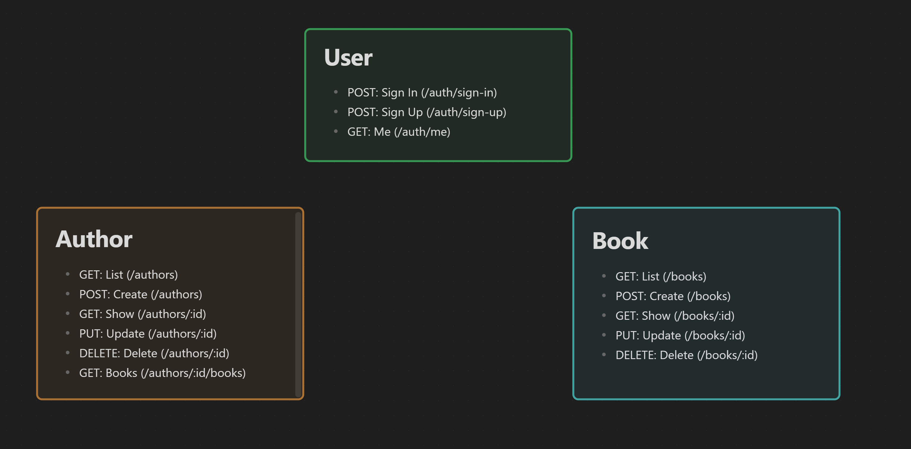
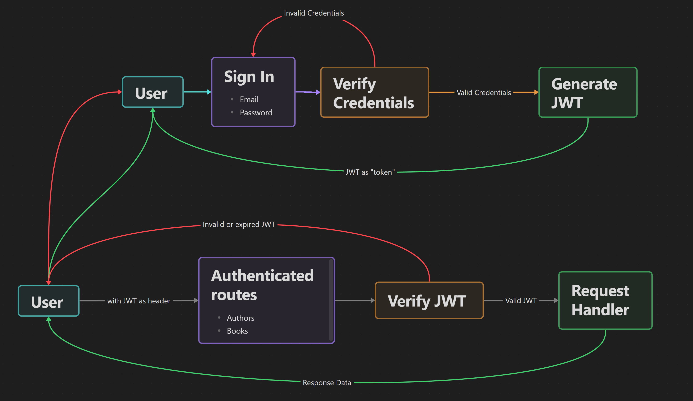
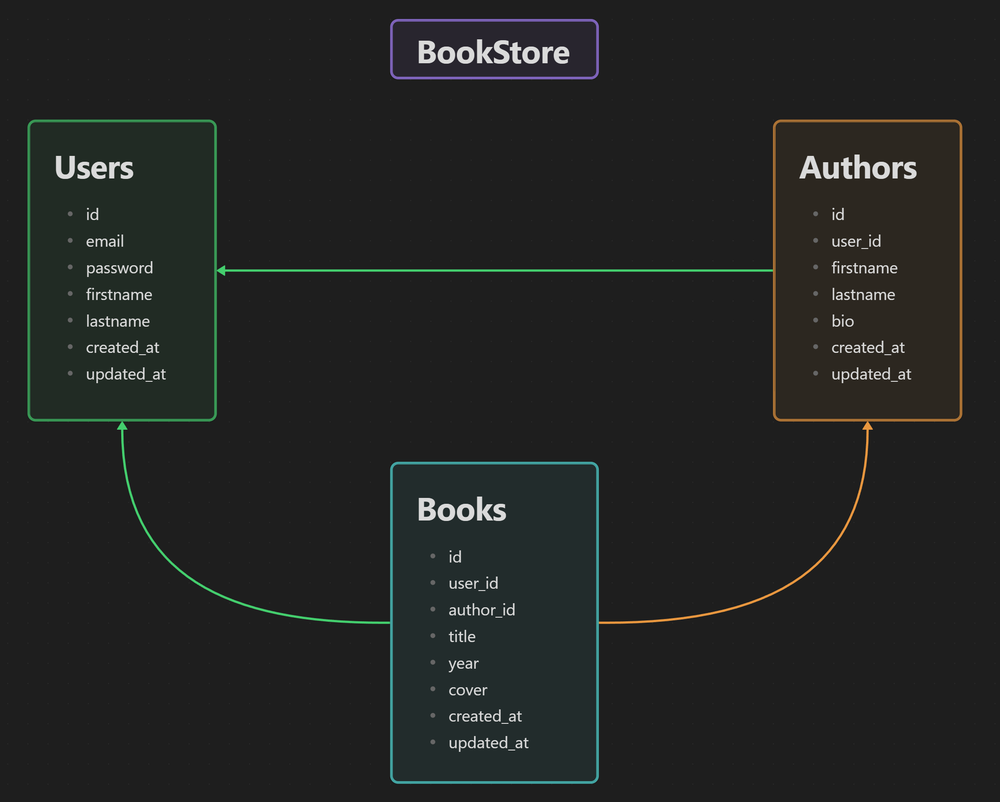

📕 BookStore
============

BookStore Management REST API Server in Rust with Rocket, SeaORM and JWT.

---

## Udemy Course
Learn about creating this in my Udemy course: [Creating an API server in Rust with Rocket, SeaORM and JWT by Afaan Bilal](https://www.udemy.com/course/rest-api-server-rust-rocket-seaorm-jwt/?referralCode=0A41F1674B329B330B9F).

---

### **Author**: [Afaan Bilal](https://afaan.dev)

---

## Run with Docker 

````
docker run --rm -it -p 8000:8000 \
    -e ROCKET_ADDRESS=0.0.0.0 \
    -e BOOKSTORE_JWT_SECRET=[RANDOM SECRET] \
    -e BOOKSTORE_DB_HOST=host.docker.internal \
    -e BOOKSTORE_DB_PORT=3306 \
    -e BOOKSTORE_DB_USERNAME=[DB USERNAME] \
    -e BOOKSTORE_DB_PASSWORD=[DB PASSWORD] \
    afaanbilal/bookstore
````

---

## Configuration
The following environment variables configure the server.

| Environment Variable  | Default value | Description                          |
| :-------------------- | :------------ | :----------------------------------- |
| BOOKSTORE_JWT_SECRET  | `[none]`      | The JWT signing secret. Must be set. |
| BOOKSTORE_DB_HOST     | `localhost`   | Database Host                        |
| BOOKSTORE_DB_PORT     | `3306`        | Database Port                        |
| BOOKSTORE_DB_USERNAME | `root`        | Database Username                    |
| BOOKSTORE_DB_PASSWORD | `[blank]`     | Database Password                    |
| BOOKSTORE_DB_DATABASE | `bookstore`   | Database Name                        |
| ROCKET_ADDRESS        | `127.0.0.1`   | HTTP Server Bind Address             |
| ROCKET_PORT           | `8000`        | HTTP Server Port                     |

---
## Run
````
cargo run
````
---

## API



| Method | Path                  | Auth? | Description                                          |
| :----- | :-------------------- | :---- | :--------------------------------------------------- |
| GET    | /                     | ⬜     | Index. Returns `Hello, World!`.                      |
| POST   | /auth/sign-up         | ⬜     | Create a new account.                                |
| POST   | /auth/sign-in         | ⬜     | Sign in. Returns a JWT on success.                   |
| GET    | /auth/me              | ✅     | Get the authenticated user's details.                |
| GET    | /authors              | ✅     | Get a list of authors.                               |
| POST   | /authors              | ✅     | Create an author.                                    |
| GET    | /authors/`{id}`       | ✅     | Get the author with matching the `id`.               |
| PUT    | /authors/`{id}`       | ✅     | Update the author matching the `id`.                 |
| DELETE | /authors/`{id}`       | ✅     | Delete the author matching the `id`.                 |
| GET    | /authors/`{id}`/books | ✅     | Get a list of books by the author matching the `id`. |
| GET    | /books                | ✅     | Get a list of books.                                 |
| POST   | /books                | ✅     | Create a book.                                       |
| GET    | /books/`{id}`         | ✅     | Get the book with matching the `id`.                 |
| PUT    | /books/`{id}`         | ✅     | Update the book matching the `id`.                   |
| DELETE | /books/`{id}`         | ✅     | Delete the book matching the `id`.                   |

## Authentication Flow



- **All auth required requests**: Add header `token` with the JWT as the value.
- **Token lifetime**: 4 hours.


---

## Database Structure



---

## Test
````
cargo test
````

---

## Entity Generation
````
sea generate entity -o src/entities -u mysql://root:@localhost:3306/bookstore
````

---

## Contributing
All contributions are welcome. Please create an issue first for any feature request
or bug. Then fork the repository, create a branch and make any changes to fix the bug
or add the feature and create a pull request. That's it!
Thanks!

---

## License
**Bookstore** is released under the MIT License.
Check out the full license [here](LICENSE).
